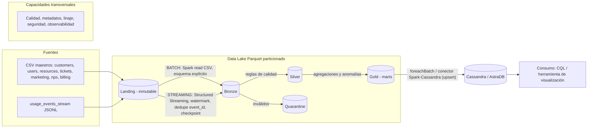

# Cloud Provider Analytics — Documento de diseño (Primera entrega)
Minería de Datos II · ISTEA · 2C 2026 · Versión 1.0 (07/10/2026)

## 1. Problema, usuarios y objetivos medibles
El área de datos de un proveedor de nube debe ingestar, limpiar, conformar y publicar datos para tres dominios.

| Dominio | Usuario | Preguntas principales |
|---|---|---|
| FinOps | Analista financiero | ¿Cuánto cuesta y consume cada organización por servicio y día? ¿Qué costos son anómalos? ¿Cuál es el revenue mensual en USD tras créditos e impuestos? |
| Soporte | Líder de soporte | ¿Cuántos tickets críticos hay por día? ¿Cuál es la tasa de SLA breach y el CSAT? |
| Producto / Usage | Product manager | ¿Qué servicios se usan más? ¿Cuántos tokens GenAI y cuánto carbono se consumen? |

**Objetivos medibles (criterios de éxito)**

| # | Objetivo | Métrica de éxito |
|---|---|---|
| O1 | Eventos disponibles en near real-time | Latencia evento → Gold < 5 min por micro-lote |
| O2 | Calidad verificable | 100 % de registros inválidos en quarantine con motivo; 0 `event_id` duplicados en Silver |
| O3 | Idempotencia | Re-ejecutar el pipeline deja idénticos los conteos (diferencia = 0) |
| O4 | Serving | Las 5 consultas mínimas responden desde Cassandra/AstraDB con filtro por partición |
| O5 | Compatibilidad de esquema | Eventos v1 y v2 conviven en Silver (`genai_tokens`/`carbon_kg` nulos en v1) |
| O6 | Conciliación financiera | Revenue USD = (subtotal − créditos + impuestos) × FX, sin subtotales negativos sin tratar |

## 2. Justificación de Big Data (5V)

| V | Evidencia en el caso | Decisión de arquitectura |
|---|---|---|
| Volumen | **43 200 eventos en 120 archivos** (12,93 MB), 60 días (~720 eventos/día); maestros con 80 orgs y 400 recursos; en producción crece por org × recurso × minuto | Parquet columnar particionado; Spark distribuido |
| Velocidad | Eventos llegan en micro-lotes; requisito near real-time | Structured Streaming con watermark y checkpoint |
| Variedad | CSV (maestros), JSONL (eventos), `tags_json` anidado, evolución de esquema v1→v2 | Esquemas explícitos; compatibilización v1/v2 en Silver |
| Veracidad | `value` como texto (1 309) y nulo (877), `unit` nulo (2 075), 211 costos < −0.01 (hasta −154 USD), 48 spikes ≥ 100 USD (hasta 317 USD), CSAT fuera de rango, **7 371 eventos (17 %) anteriores a la creación del recurso** (ver §3) | Reglas de calidad, quarantine, flags de anomalía |
| Valor | Decisiones de costo (FinOps), servicio (Soporte), producto (GenAI/carbono) | Marts Gold + serving query-first en Cassandra |

> Honestidad técnica: el dataset de curso cabe en una máquina. La justificación de Big Data se apoya en la **proyección de escala** y en velocidad/variedad/veracidad, no en el tamaño actual.

## 3. Inventario y perfil de fuentes
Perfil generado por `src/exploration/profile_landing_csv.py` (evidencia en `evidence/perfil_fuentes_csv.md`).

| Fuente | Filas | Grano / clave natural | Frecuencia | Hallazgos de calidad / riesgos |
|---|---|---|---|---|
| customers_orgs.csv | 80 | 1 fila por `org_id` | Batch diario | `nps_score` nulo 13.8 %; 1 valor > 100 (fuera de rango) |
| users.csv | 800 | `user_id` | Batch diario | `last_login` nulo 17.4 %; **232 con `last_login` < `created_at`** |
| resources.csv | 400 | `resource_id` | Batch diario | `tags_json` nulo 20.8 % (string con lista JSON); 6 servicios, 7 regiones |
| support_tickets.csv | 1000 | `ticket_id` | Batch diario | `resolved_at` nulo 24 % (abiertos); `csat` nulo 25.4 %; **40 CSAT fuera de [1,5]** (0, 6, 7); 172 CSAT sin `resolved_at`; SLA breach 9.5 % |
| marketing_touches.csv | 1500 | `touch_id` | Batch diario | **96 `converted` sin `clicked`** (inconsistencia lógica) |
| nps_surveys.csv | 92 | (`org_id`, `survey_date`) | Batch mensual | `nps_score` nulo 20.7 %; `comment` nulo 10.9 % |
| billing_monthly.csv | 240 | `invoice_id`; 3 meses × 80 orgs | Batch mensual | `credits` nulo 57 % (¿0?); **13 `subtotal` negativos**; monedas USD/EUR/ARS con `exchange_rate_to_usd` |
| usage_events_stream/*.jsonl | 120 archivos × 360 = **43 200 eventos** (12,93 MB) | `event_id` (`evt_` + 12 car.) | Streaming (micro-lotes) | Ver §3.1 |

### 3.1 Perfil de `usage_events_stream` (120 archivos = 43 200 eventos)
Evidencia: `evidence/perfil_usage_events.md`, generado por `src/exploration/profile_usage_events.py` sobre los 120 archivos de Landing (solo lectura).

| Aspecto | Hallazgo | Implicancia de diseño |
|---|---|---|
| Esquema v1 (10 800 ev., 25 %) | `event_id, timestamp, org_id, resource_id, service, region, metric, value, unit, cost_usd_increment, schema_version` | Esquema base explícito |
| Esquema v2 (32 400 ev., 75 %) | v1 + `carbon_kg` (siempre) + `genai_tokens` (3 132 eventos, solo servicio `genai`; 0 fuera de regla) | Silver unifica: en v1 ambos quedan `NULL` |
| Corte de versión | v1: 03–17/07/2025; v2: desde 18/07/2025 | Se valida `schema_version` contra la fecha |
| Métricas y unidades | `requests` (`count`), `cpu_hours` (`hours`), `storage_gb_hours` (`gb_hours`); 6 servicios y 7 regiones | Pivot de `metric` para features |
| `value` | float, **string 1 309 (3,0 %, 0 no casteables)**, **nulo 877 (2,0 %)** | Cast con fallback controlado (Q4) |
| `unit` | **nulo 2 075 (4,8 %); 2 038 con `value` informado** | Regla Q3; `unit` imputable desde `metric` (1:1) |
| `cost_usd_increment` | mediana 1,00 USD; **211 < −0.01 (0,5 %; mín. −154,46)**; **48 ≥ 100 USD (0,1 %; máx. 317,43)** | Q2 + flag; anomalías con MAD por servicio |
| `carbon_kg` | 0 – 0,0326; 2 641 ceros | Válido; los ceros no son outliers |
| Ritmo | ~720 eventos/día durante 60 días | Volumen estable |
| **Orden temporal** | **Los 120 archivos abarcan todo el rango 03/07–31/08**; timestamps desordenados | **Crítico para watermark y dedupe (ver §5.1)** |
| Duplicados | **0 `event_id` duplicados, ni dentro ni entre archivos** | Dedupe igual obligatorio por idempotencia ante re-ingesta |
| Integridad | 0 `resource_id` huérfanos; `org_id`, `service` y `region` coinciden con `resources.csv` en el 100 % | Join evento→recurso confiable |
| **Anomalía temporal** | **7 371 eventos (17,1 %) anteriores al `created_at` del recurso** | Regla Q8: flag, no descarte |

**Integridad referencial de los maestros:** 0 `org_id` huérfanos en todas las fuentes respecto de `customers_orgs`. Cada org tiene exactamente 3 facturas.

**Trazabilidad:** toda tabla Bronze lleva `ingest_ts` y `source_file`; Landing es inmutable.

**Riesgos de datos principales:** (0) eventos con timestamps globalmente desordenados entre archivos; (1) ambigüedad de `credits` nulo; (2) cómo tratar subtotales negativos (¿notas de crédito?); (3) escala de `nps_score` (individual vs. agregada); (4) semántica real de `last_login < created_at`.

## 4. Arquitectura de alto nivel (v1)



**Distinción batch vs. streaming**

| | Batch | Streaming |
|---|---|---|
| Fuentes | 7 CSV (maestros, tickets, facturación, encuestas) | `usage_events_stream/*.jsonl` |
| Motor | Spark DataFrame, lectura CSV con esquema explícito | Spark Structured Streaming (`readStream` sobre directorio) |
| Cadencia | Diaria (maestros) / mensual (billing, NPS) | Micro-lotes (`availableNow` en Colab; `processingTime` en producción) |
| Claves de control | Clave natural + sobrescritura por partición | `event_id` + watermark + checkpoint |
| Salida | Bronze → Silver → Gold | Bronze → Silver → Gold (mismo destino) |

## 5. Patrón elegido: Lambda
**Decisión:** Lambda — batch para maestros, facturación y encuestas; streaming para `usage_events_stream` con ventanas, watermark e idempotencia.

**Por qué:** (a) las fuentes tienen naturalezas distintas: maestros y facturación cambian poco y son mensuales/diarios, los eventos son continuos; (b) hacer Kappa obligaría a modelar maestros como streams sin ganancia de latencia; (c) Lambda mapea 1:1 con el requisito invariable de la consigna; (d) ambas ramas convergen en las mismas capas Silver/Gold, lo que evita duplicar lógica de negocio.
**Trade-off aceptado:** dos caminos de código que mantener. **Mitigación:** funciones de transformación compartidas (`src/common/`) y un único destino Gold.
**Alternativa descartada:** Kappa (re-stream de todo) — mayor complejidad operativa para fuentes sin requisito de latencia.

### 5.1 Consecuencia del orden de los eventos sobre el watermark
Cada archivo contiene eventos de **todo** el período, mezclados. Con `maxFilesPerTrigger` y un watermark corto (p. ej. 10 min), tras el primer micro-lote el watermark quedaría cerca de fines de agosto y Spark descartaría como *late* casi todo lo que llegue después (en `dropDuplicates` con watermark y en agregaciones por ventana).
**Decisión:** el watermark se parametriza y se fija en un valor ≥ al rango observado (~61 días) para la demostración, o se deduplica por `event_id` en Bronze→Silver (batch sobre el micro-lote) sin depender del estado temporal. El *late data* se demuestra con un archivo de prueba con timestamps anteriores al watermark. Esto se documenta como trade-off: más estado en memoria a cambio de no perder eventos.

## 6. Matriz requisito → componente

| Req. | Requisito | Componente | 5V | Evidencia / criterio |
|---|---|---|---|---|
| R1 | Ingesta batch con esquemas explícitos | Spark `read.csv` + `StructType` → Bronze | Variedad | Bronze Parquet con `ingest_ts`, `source_file` |
| R2 | Ingesta streaming con watermark, dedupe, late data, checkpoint | Structured Streaming + `dropDuplicates(event_id)` + `checkpointLocation` | Velocidad | Re-ejecución sin duplicados |
| R3 | Calidad y quarantine | Módulo de reglas → `quarantine/` Parquet | Veracidad | Conteo válidos/inválidos + muestras |
| R4 | Silver conformado, compatibilidad v1/v2 | Spark SQL, normalización, joins con dimensiones | Variedad / Veracidad | `genai_tokens`, `carbon_kg` nulos en v1 |
| R5 | Features (`daily_cost_usd`, `requests`, `cpu_hours`, `storage_gb_hours`, `genai_tokens`, `carbon_kg`) | Agregaciones Spark | Valor | Esquema Silver documentado |
| R6 | Anomalías | MAD / z-score robusto por org+servicio | Veracidad / Valor | Flag y score en `cost_anomaly_mart` |
| R7 | Marts Gold por dominio | 5 marts (ver §7.3) | Valor | Grano documentado |
| R8 | Serving query-first | Cassandra/AstraDB, una tabla por consulta | Valor | 5 consultas CQL |
| R9 | Idempotencia | Claves naturales + upsert (Cassandra) + checkpoints | Veracidad | Conteos antes/después |
| R10 | Performance | Particionado por fecha/servicio, `coalesce` | Volumen | Tamaños y rutas |
| R11 | Gobierno | Metadatos, linaje por columnas técnicas, secretos en entorno | — | `docs/` + README |

## 7. Diseño del Data Lake
### 7.1 Zonas, formatos y naming
Raíz: `datalake/{landing,bronze,silver,gold,quarantine,_checkpoints}/`

| Zona | Contenido | Formato | Partición | Retención | Regla de promoción |
|---|---|---|---|---|---|
| Landing | Archivos originales | CSV / JSONL | — (inmutable) | Permanente | Solo lectura; nunca se modifica |
| Bronze | Mismo grano que la fuente, tipado explícito, `ingest_ts`, `source_file` | Parquet (snappy) | Eventos: `event_date`; maestros: sin partición o `ingest_date` | Permanente (reprocesable) | Esquema válido y dedupe técnico |
| Silver | Conformado, joins, outliers tratados, v1/v2 unificado | Parquet | `usage_date` (60 particiones diarias; ~720 filas c/u: se valida con `coalesce`) | 12 meses (propuesto) | Pasa reglas de calidad |
| Gold | Marts de negocio | Parquet | Según grano (`usage_date`, `month`) | 12 meses (propuesto) | Agregación validada y conciliada |
| Quarantine | Registros inválidos + motivo + `source_file` | Parquet | `rule_id` / `ingest_date` | 90 días (propuesto) | Revisión manual / reproceso |

**Naming:** `bronze/<fuente>/`, `silver/<entidad>/`, `gold/<mart>/` en snake_case; columnas en snake_case en inglés.
**Justificación de particiones:** los eventos se consultan por rango de fechas → partición por fecha (60 días). Con ~720 eventos por día, cada partición es muy pequeña (problema de *small files*): se usa `coalesce(1)` por partición y se documenta que en producción convendría particionar por mes o por semana. `service` (6 valores) no se usa como partición por la misma razón.
**Metadatos:** esquema por tabla en `docs/diccionario_datos.md`, columnas técnicas `ingest_ts`, `source_file`, `schema_version`, `pipeline_run_id`.

### 7.2 Reglas de calidad iniciales (verificables)
| ID | Regla | Acción |
|---|---|---|
| Q1 | `event_id` no nulo y único | Nulo → quarantine; duplicado → conservar primero |
| Q2 | `cost_usd_increment >= -0.01` | Menor → quarantine + flag de anomalía |
| Q3 | `unit` no nulo cuando existe `value` | Quarantine (2 038 casos, 4,7 %); alternativa: imputar `unit` desde `metric` (relación 1:1) |
| Q4 | `value` casteable a numérico | Cast con fallback; si falla → null + flag (1 309 strings, todas casteables; 877 nulos) |
| Q5 | `csat` en [1,5] | Fuera de rango → null + flag |
| Q6 | `org_id` existe en `customers_orgs` | Huérfano → quarantine |
| Q7 | `subtotal >= 0` en billing | Negativo → flag (posible nota de crédito) |
| Q8 | `timestamp` del evento ≥ `created_at` del recurso | Flag `event_before_resource` (7 371 casos, 17,1 %); no se descarta |
| Q9 | `genai_tokens` solo si `service = genai` y `schema_version = 2` | Fuera de regla → flag |

### 7.3 Marts Gold previstos
| Mart | Grano | Contenido |
|---|---|---|
| org_daily_usage_by_service | org_id, usage_date, service | costo, requests, cpu_hours, storage_gb_hours |
| revenue_by_org_month | org_id, month | revenue USD, créditos, impuestos, FX |
| cost_anomaly_mart | org_id, date, service | score MAD, flag, contexto |
| tickets_by_org_date | org_id, date, severity | conteo, SLA breach rate, CSAT |
| genai_tokens_by_org_date | org_id, date | tokens, costo estimado |

### 7.4 Modelo de serving (adelanto, query-first)
Una tabla por consulta; la clave de partición responde el filtro principal y las columnas de clustering ordenan por fecha.
Ejemplo: `usage_by_org_service_day (org_id, service, usage_date DESC) PRIMARY KEY ((org_id, service), usage_date)`.
Los upserts de Cassandra con esa clave natural dan idempotencia de la carga.

## 8. Flujos de datos con herramientas
- **Batch:** `Landing CSV → spark.read.csv(schema) → + ingest_ts/source_file → Bronze Parquet → limpieza/joins → Silver → agregación → Gold → upsert Cassandra`.
- **Streaming:** `Landing JSONL → readStream(schema, maxFilesPerTrigger) → withWatermark(ts) → dropDuplicates(event_id) → Bronze (checkpoint) → foreachBatch: reglas → Silver / Quarantine → Gold incremental → Cassandra`.
- **Herramientas:** PySpark 3.5, Parquet, Google Colab (o equivalente), AstraDB, Python `cassandra-driver` / Spark-Cassandra-Connector, Git.

## 9. Flujo batch con lógica MapReduce
**Caso:** revenue mensual por organización en USD (`revenue_by_org_month`).

| Fase | Operación | Ejemplo |
|---|---|---|
| Map | Leer cada factura y emitir `((org_id, month), revenue_usd)` con `revenue_usd = (subtotal − coalesce(credits,0) + taxes) × exchange_rate_to_usd` | `inv_nym31sk0 → ((org_xaji0y6d, 2025-06), 1.23e3)` |
| Shuffle | Agrupar por clave `(org_id, month)` | Todas las filas de la misma org/mes llegan al mismo reducer |
| Reduce | Sumar `revenue_usd`, `credits_usd`, `taxes_usd` | `((org, mes), total)` |

Equivalente en Spark:
```python
(df.withColumn("revenue_usd", (F.col("subtotal") - F.coalesce("credits", F.lit(0)) + F.col("taxes")) * F.col("exchange_rate_to_usd"))
   .groupBy("org_id", "month").agg(F.sum("revenue_usd").alias("revenue_usd")))
```
Segundo ejemplo (eventos): map → `((org_id, date, service), (cost, requests))`; reduce → suma por clave = `org_daily_usage_by_service`.
Spark reemplaza Map/Shuffle/Reduce por `select/withColumn`, `groupBy` (shuffle) y `agg`.

## 10. Supuestos, riesgos, mitigaciones y decisiones abiertas
| # | Supuesto / riesgo | Prob. | Impacto | Mitigación |
|---|---|---|---|---|
| 1 | Colab sin persistencia → se pierde el Lake | Alta | Alto | Lake en Google Drive o disco local; script de reinicio |
| 2 | Límites del plan gratuito de AstraDB | Media | Alto | Cargar solo Gold; datos de demo reducidos |
| 3 | Aparece una `schema_version` nueva en datos futuros | Baja | Medio | `schema_version` explícito y regla que alerta versiones desconocidas; compatibilidad v1/v2 ya diseñada |
| 3b | Watermark corto descarta eventos válidos (archivos con todo el rango temporal) | Alta | Alto | Watermark ≥ 61 días o dedupe sin estado temporal (ver §5.1) |
| 3c | Archivos pequeños (~720 eventos/día) | Alta | Bajo | `coalesce`, partición diaria con 1 archivo; documentar alternativa mensual |
| 4 | Late data / spikes mal tratados | Media | Medio | Watermark parametrizable; MAD robusto a outliers |
| 5 | Subtotales negativos y `credits` nulo ambiguos | Alta | Medio | Documentar supuesto (`credits` nulo = 0); flag, no borrar |
| 6 | Credenciales expuestas en el repo | Baja | Alto | `.gitignore`, variables de entorno, `settings.example.yaml` |
| 7 | Dos caminos de código (Lambda) divergen | Media | Medio | Funciones compartidas y tests |

**Decisiones abiertas:** valor final del watermark (ver §5.1); tratamiento de `unit` nulo (quarantine vs. imputar); estrategia ante `credits` nulo; método de anomalías final (MAD vs. z-score); SCD tipo 2 para `plan_tier` / `lifecycle_stage`; componente ML (propuesta: detección de anomalías de costo o predicción de churn).

## 11. Estimación de esfuerzo, roles y recursos
| Etapa | Entregable | Esfuerzo (h-persona) |
|---|---|---|
| 1 | Diseño y fundación (esta entrega) | 20 |
| 2 | Batch + streaming a Bronze | 25 |
| 3 | Silver, calidad y features | 25 |
| 4 | Gold + Cassandra + consultas | 25 |
| 5 | ML/anomalías, gobierno, pruebas, docs, video | 30 |
| | **Total estimado** | **~125** |

**Roles:** ingeniería de datos (ingesta/Spark), calidad y gobierno, serving/Cassandra, analítica/ML, documentación y defensa.
**Recursos:** Google Colab, cuenta AstraDB (free tier), GitHub, Drive o disco local para el Lake.

## 12. Próximos pasos
Bronze batch (3 maestros) → Bronze streaming → Silver y reglas Q1–Q7 → Gold `org_daily_usage_by_service` → Cassandra.
